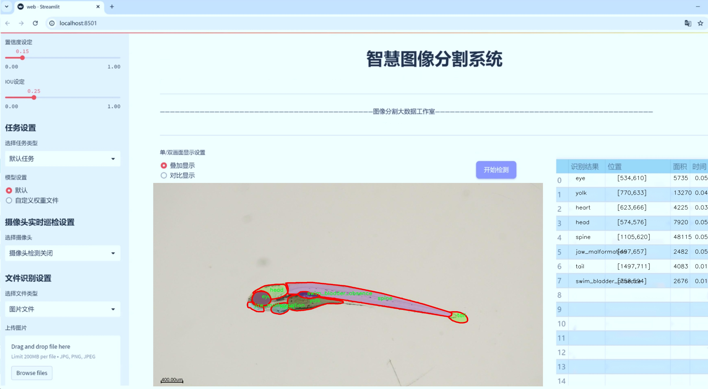
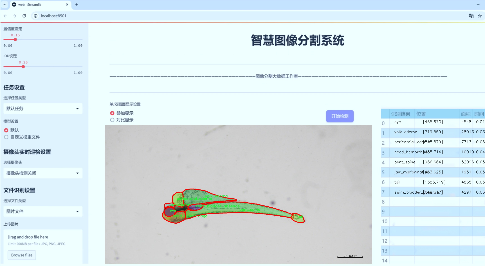
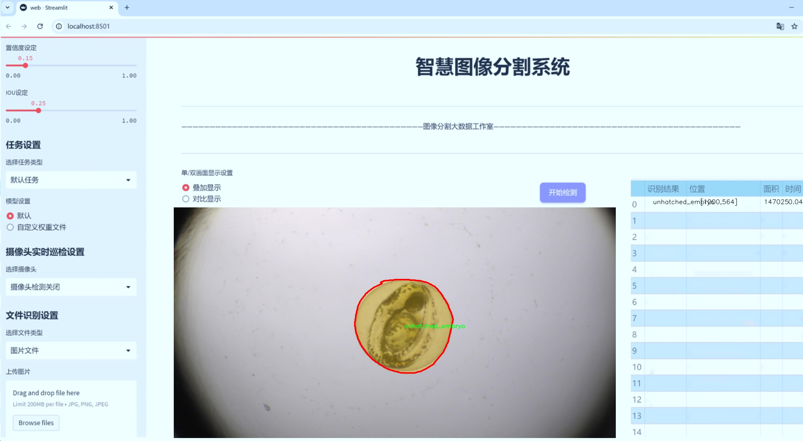
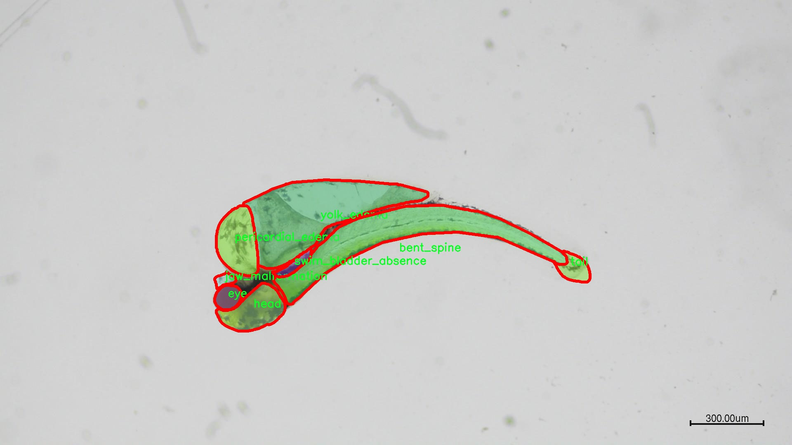
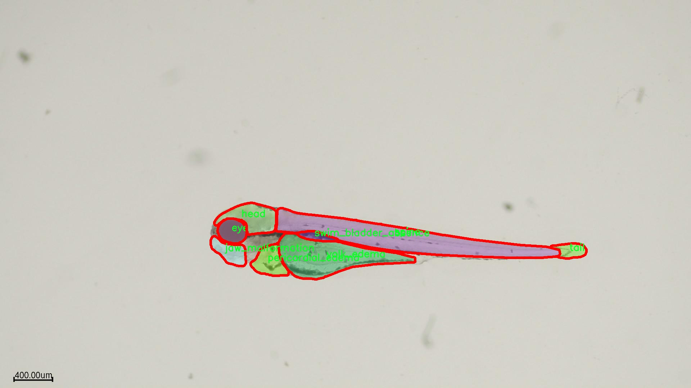
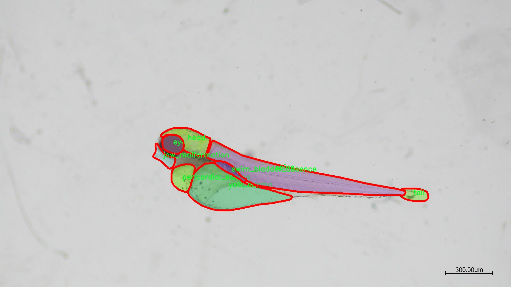
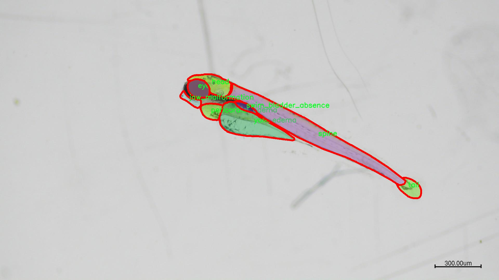
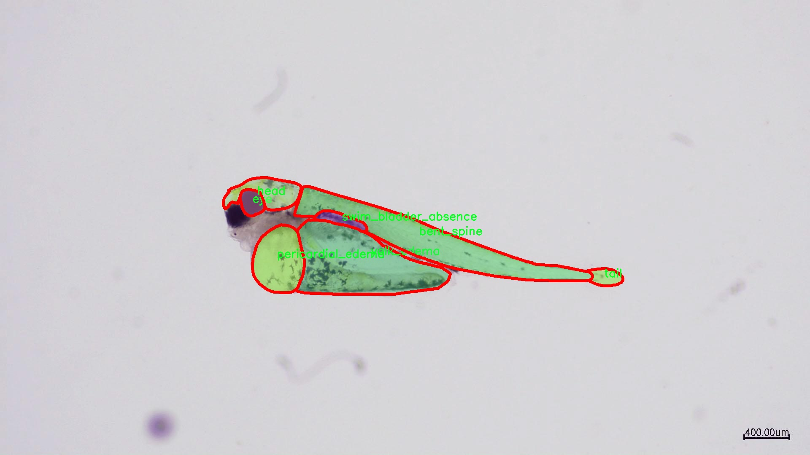

# 斑马鱼器官分割系统： yolov8-seg-C2f-RFAConv

### 1.研究背景与意义

[参考博客](https://gitee.com/YOLOv8_YOLOv11_Segmentation_Studio/projects)

[博客来源](https://kdocs.cn/l/cszuIiCKVNis)

研究背景与意义

随着生物医学研究的不断深入，斑马鱼作为一种重要的模式生物，因其独特的生物学特性和透明的胚胎结构，逐渐成为发育生物学、遗传学及药物筛选等领域的重要研究对象。斑马鱼的器官发育过程及其在不同环境下的生理变化，为科学家提供了丰富的实验材料。然而，传统的斑马鱼器官观察和分析方法往往依赖于人工标注，效率低下且容易受到主观因素的影响。因此，开发一种高效、准确的斑马鱼器官分割系统显得尤为重要。

近年来，深度学习技术的迅猛发展为图像分割任务提供了新的解决方案。YOLO（You Only Look Once）系列模型以其快速和高效的特性，在目标检测和分割领域取得了显著的成果。YOLOv8作为该系列的最新版本，结合了多种先进的网络结构和优化算法，能够在保持高精度的同时，显著提高处理速度。针对斑马鱼器官分割的需求，基于改进YOLOv8的分割系统将为斑马鱼的生物医学研究提供强有力的技术支持。

本研究所使用的数据集包含1300幅图像，涵盖了16个不同的器官类别，包括弯曲脊柱、死亡、眼睛、头部、头部出血、心脏、下颌畸形、心包水肿、脊柱、游泳膀胱、游泳膀胱缺失、尾巴、未孵化胚胎、卵黄及卵黄水肿等。这些类别的多样性不仅反映了斑马鱼在不同发育阶段的器官特征，也为模型的训练和验证提供了丰富的样本。通过对这些器官的精确分割，研究人员能够更好地理解斑马鱼的生理特征及其在疾病模型中的表现。

改进YOLOv8的斑马鱼器官分割系统，旨在通过深度学习技术实现对斑马鱼器官的自动化分割，减少人工干预，提高分割的准确性和效率。这一系统的建立不仅能够为斑马鱼的生物医学研究提供便捷的工具，还将推动相关领域的研究进展。具体而言，该系统能够在药物筛选、基因功能研究及发育异常分析等方面发挥重要作用，帮助科学家快速获取斑马鱼器官的形态学信息，进而加深对其生物学机制的理解。

此外，基于改进YOLOv8的分割系统还具有广泛的应用前景。随着生物医学影像技术的不断发展，该系统可扩展至其他模式生物的器官分割任务，甚至在临床医学影像分析中也有潜在的应用价值。通过不断优化和完善该系统，未来有望为生物医学研究提供更为高效的解决方案，推动相关领域的技术进步与创新。

综上所述，基于改进YOLOv8的斑马鱼器官分割系统的研究，不仅具有重要的学术价值，也为生物医学研究提供了实用的工具和方法，具有广泛的应用前景和深远的社会意义。

### 2.图片演示







注意：本项目提供完整的训练源码数据集和训练教程,由于此博客编辑较早,暂不提供权重文件（best.pt）,需要按照6.训练教程进行训练后实现上图效果。

### 3.视频演示

[3.1 视频演示](https://www.bilibili.com/video/BV1VKm2YVE3E/)

### 4.数据集信息

##### 4.1 数据集类别数＆类别名

nc: 16
names: ['bent_spine', 'dead', 'eye', 'head', 'head_hemorrhage', 'heart', 'jaw_malformation', 'lower_jaw', 'pericardial_edema', 'spine', 'swim_bladder', 'swim_bladder_absence', 'tail', 'unhatched_embryo', 'yolk', 'yolk_edema']


##### 4.2 数据集信息简介

数据集信息展示

在本研究中，我们使用了名为“gqdata”的数据集，以改进YOLOv8-seg模型在斑马鱼器官分割任务中的表现。该数据集包含16个不同的类别，旨在为斑马鱼的生物医学研究提供丰富的标注数据，帮助研究人员更好地理解斑马鱼在发育过程中的器官形成及其相关病理变化。具体而言，这16个类别包括：弯曲脊柱（bent_spine）、死亡（dead）、眼睛（eye）、头部（head）、头部出血（head_hemorrhage）、心脏（heart）、下颌畸形（jaw_malformation）、下颌（lower_jaw）、心包水肿（pericardial_edema）、脊柱（spine）、游泳膀胱（swim_bladder）、游泳膀胱缺失（swim_bladder_absence）、尾部（tail）、未孵化胚胎（unhatched_embryo）、卵黄（yolk）以及卵黄水肿（yolk_edema）。

该数据集的构建旨在满足现代深度学习模型对高质量标注数据的需求，尤其是在生物医学图像分析领域。每个类别都经过精细的标注，确保模型在训练过程中能够准确学习到各个器官的特征。这些类别不仅涵盖了正常的器官结构，还包括了多种病理状态，提供了丰富的样本用于训练和验证。通过对这些类别的深入分析，研究人员能够识别出斑马鱼在不同发育阶段的器官特征及其潜在的病理变化。

在数据集的构建过程中，采用了多种图像采集技术，确保了数据的多样性和代表性。每个类别的样本数量经过精心设计，以避免类别不平衡对模型训练的影响。此外，数据集还包含了不同发育阶段的斑马鱼图像，进一步增强了模型的泛化能力。这一切都为YOLOv8-seg模型的训练提供了坚实的基础，使其能够在斑马鱼器官分割任务中表现出色。

在实际应用中，gqdata数据集的使用将有助于推动斑马鱼作为模式生物在药物筛选、疾病模型建立及基因功能研究等领域的应用。通过高效的器官分割，研究人员可以更好地分析斑马鱼的生理和病理特征，进而为人类疾病的研究提供重要的实验依据。

总之，gqdata数据集不仅是一个用于训练YOLOv8-seg模型的工具，更是推动斑马鱼生物医学研究的重要资源。通过对斑马鱼器官的精确分割，研究人员能够深入探索生物学的奥秘，为未来的科学研究开辟新的方向。随着深度学习技术的不断进步，gqdata数据集的应用前景将更加广阔，为斑马鱼的研究带来更多可能性。











### 5.项目依赖环境部署教程（零基础手把手教学）

[5.1 环境部署教程链接（零基础手把手教学）](https://www.bilibili.com/video/BV1jG4Ve4E9t/?vd_source=bc9aec86d164b67a7004b996143742dc)


[5.2 安装Python虚拟环境创建和依赖库安装视频教程链接（零基础手把手教学）](https://www.bilibili.com/video/BV1nA4VeYEze/?vd_source=bc9aec86d164b67a7004b996143742dc)

### 6.手把手YOLOV8-seg训练视频教程（零基础手把手教学）

[6.1 手把手YOLOV8-seg训练视频教程（零基础小白有手就能学会）](https://www.bilibili.com/video/BV1cA4VeYETe/?vd_source=bc9aec86d164b67a7004b996143742dc)


按照上面的训练视频教程链接加载项目提供的数据集，运行train.py即可开始训练



     Epoch   gpu_mem       box       obj       cls    labels  img_size
     1/200     0G   0.01576   0.01955  0.007536        22      1280: 100%|██████████| 849/849 [14:42<00:00,  1.04s/it]
               Class     Images     Labels          P          R     mAP@.5 mAP@.5:.95: 100%|██████████| 213/213 [01:14<00:00,  2.87it/s]
                 all       3395      17314      0.994      0.957      0.0957      0.0843

     Epoch   gpu_mem       box       obj       cls    labels  img_size
     2/200     0G   0.01578   0.01923  0.007006        22      1280: 100%|██████████| 849/849 [14:44<00:00,  1.04s/it]
               Class     Images     Labels          P          R     mAP@.5 mAP@.5:.95: 100%|██████████| 213/213 [01:12<00:00,  2.95it/s]
                 all       3395      17314      0.996      0.956      0.0957      0.0845

     Epoch   gpu_mem       box       obj       cls    labels  img_size
     3/200     0G   0.01561    0.0191  0.006895        27      1280: 100%|██████████| 849/849 [10:56<00:00,  1.29it/s]
               Class     Images     Labels          P          R     mAP@.5 mAP@.5:.95: 100%|███████   | 187/213 [00:52<00:00,  4.04it/s]
                 all       3395      17314      0.996      0.957      0.0957      0.0845


### 7.50+种全套YOLOV8-seg创新点加载调参实验视频教程（一键加载写好的改进模型的配置文件）

[7.1 50+种全套YOLOV8-seg创新点加载调参实验视频教程（一键加载写好的改进模型的配置文件）](https://www.bilibili.com/video/BV1Hw4VePEXv/?vd_source=bc9aec86d164b67a7004b996143742dc)

### YOLOV8-seg算法简介

原始YOLOv8-seg算法原理

YOLOv8-seg算法是YOLO系列目标检测算法的最新版本，旨在进一步提升目标检测和分割的性能。该算法由Glenn-Jocher提出，承袭了YOLOv3和YOLOv5的设计理念，并在此基础上进行了多项创新和改进，特别是在数据预处理、网络结构、标签分配策略等方面的优化，使其在处理复杂场景时展现出更高的精度和效率。

首先，YOLOv8-seg在数据预处理方面延续了YOLOv5的成功策略，采用了多种数据增强技术以提高模型的鲁棒性。具体而言，算法在训练过程中引入了马赛克增强、混合增强、空间扰动和颜色扰动等四种增强手段。这些增强技术不仅丰富了训练数据的多样性，还有效地防止了模型过拟合，使得YOLOv8-seg能够在各种环境下保持良好的检测性能。

在网络结构方面，YOLOv8-seg的骨干网络结构进行了重要的更新。与YOLOv5的C3模块相比，YOLOv8-seg引入了C2f模块，这一新模块通过增加更多的分支来丰富梯度回传时的支流，进而增强了特征提取的能力。C2f模块的设计理念在于通过更复杂的网络结构来捕捉图像中的细微特征，尤其是在目标分割任务中，这种能力显得尤为重要。通过这种方式，YOLOv8-seg能够更有效地提取多尺度特征，为后续的目标检测和分割提供更为精准的基础。

YOLOv8-seg还采用了FPN-PAN结构，这一结构的设计旨在充分融合多尺度信息，以提高模型对不同大小目标的检测能力。尽管FPN-PAN结构与YOLOv5保持了一致性，但C3模块的替换使得特征融合的效率和效果得到了显著提升。这种多尺度特征融合的能力，使得YOLOv8-seg在处理复杂场景时，能够更好地应对目标的多样性和变化性。

在检测头的设计上，YOLOv8-seg同样做出了重要的创新。它采用了解耦头结构，将分类和定位任务分开处理。这一设计使得模型在处理目标时，能够更专注于各自的任务，从而提高了整体的检测精度。解耦头的并行分支结构不仅提升了模型的灵活性，还增强了对不同目标的适应能力，使得YOLOv8-seg在实际应用中表现出色。

标签分配策略是YOLOv8-seg的一大亮点。与YOLOv5依赖于候选框聚类的方式不同，YOLOv8-seg采用了TOOD策略进行动态标签分配。这一策略通过targetbboxes和targetscores的结合，优化了正负样本的匹配过程，确保了不同尺度目标的有效学习。特别是在处理复杂场景时，TOOD策略能够动态调整标签分配，从而提升模型的训练效率和准确性。

此外，YOLOv8-seg在损失函数的设计上也进行了创新。其分类损失采用了Varifocal Loss（VFL），而回归损失则结合了CIoULoss与DFLLoss。这种设计不仅提高了模型对正样本的关注度，还有效降低了负样本对损失的影响，使得模型在训练过程中能够更好地聚焦于高质量的样本，从而提升整体的检测性能。

YOLOv8-seg的轻量化设计也是其一大优势。通过优化网络结构，减少冗余计算，YOLOv8-seg在保持高精度的同时，实现了更快的推理速度。这使得该算法在实时应用场景中表现出色，能够满足对速度和精度的双重需求。

综上所述，YOLOv8-seg算法通过在数据预处理、网络结构、标签分配策略和损失函数等多个方面的创新，显著提升了目标检测和分割的性能。其在处理复杂场景时的高效性和准确性，使得YOLOv8-seg成为当前目标检测领域的一项重要进展，广泛应用于智能监控、自动驾驶、人脸识别等多个领域，展现出强大的实用价值和广阔的应用前景。随着YOLOv8-seg的不断发展和优化，未来有望在更多的实际应用中发挥更大的作用。


### 9.系统功能展示（检测对象为举例，实际内容以本项目数据集为准）

图9.1.系统支持检测结果表格显示

  图9.2.系统支持置信度和IOU阈值手动调节

  图9.3.系统支持自定义加载权重文件best.pt(需要你通过步骤5中训练获得)

  图9.4.系统支持摄像头实时识别

  图9.5.系统支持图片识别

  图9.6.系统支持视频识别

  图9.7.系统支持识别结果文件自动保存

  图9.8.系统支持Excel导出检测结果数据


### 10.50+种全套YOLOV8-seg创新点原理讲解（非科班也可以轻松写刊发刊，V11版本正在科研待更新）

#### 10.1 由于篇幅限制，每个创新点的具体原理讲解就不一一展开，具体见下列网址中的创新点对应子项目的技术原理博客网址【Blog】：


[10.1 50+种全套YOLOV8-seg创新点原理讲解链接](https://gitee.com/qunmasj/good)

#### 10.2 部分改进模块原理讲解(完整的改进原理见上图和技术博客链接)【如果此小节的图加载失败可以通过CSDN或者Github搜索该博客的标题访问原始博客，原始博客图片显示正常】
### YOLOv8简介
Yolov8主要借鉴了Yolov5、Yolov6、YoloX等模型的设计优点，其本身创新点不多，偏重在工程实践上，具体创新如下:
·提供了一个全新的SOTA模型（包括P5 640和P6 1280分辨率的目标检测网络和基于YOLACT的实例分割模型)。并且，基于缩放系数提供了N/S/M/IL/X不同尺度的模型，以满足不同部署平台和应用场景的需求。
●Backbone:同样借鉴了CSP模块思想，不过将Yolov5中的C3模块替换成了C2f模块，实现了进一步轻量化，同时沿用Yolov5中的SPPF模块，并对不同尺度的模型进行精心微调，不再是无脑式—套参数用于所有模型，大幅提升了模型性能。
●Neck:继续使用PAN的思想，但是通过对比YOLOv5与YOLOv8的结构图可以看到，YOLOv8移除了1*1降采样层。
●Head部分相比YOLOv5改动较大，Yolov8换成了目前主流的解耦头结构(Decoupled-Head)，将分类和检测头分离，同时也从Anchor-Based换成了Anchor-Free。
●Loss计算:使用VFLLoss作为分类损失(实际训练中使用BCE Loss);使用DFLLoss+ClOU Loss作为回归损失。
●标签分配: Yolov8抛弃了以往的loU分配或者单边比例的分配方式，而是采用Task-Aligned Assigner正负样本分配策略。
#### Yolov8网络结构
Yolov8模型网络结构图如下图所示。


#### Backbone
Yolov8的Backbone同样借鉴了CSPDarkNet结构网络结构，与Yolov5最大区别是，Yolov8使用C2f模块代替C3模块。具体改进如下:
·第一个卷积层的Kernel size从6×6改为3x3。
·所有的C3模块改为C2f模块，如下图所示，多了更多的跳层连接和额外Split操作。。Block数由C3模块3-6-9-3改为C2f模块的3-6-6-3。

### 上下文引导网络（CGNet）简介


高准确率的模型（蓝点），由图像分类网络转化而来且参数量大，因此大多不适于移动设备。
低分辨率的小模型（红点），遵循分类网络的设计方式，忽略了分割特性，故而效果不好。
#### CGNet的设计：
为了提升准确率，用cgnet探索语义分割的固有属性。对于准确率的提升，因为语义分割是像素级分类和目标定位，所以空间依赖性和上下文信息发挥了重要作用。因此，设计cg模块，用于建模空间依赖性和语义上下文信息。
- 1、cg模块学习局部特征和周围特征形成联合特征
- 2、通过逐通道重新加权（强调有用信息，压缩无用信息），用全局特征改善联合特征
- 3、在全阶段应用cg模块，以便从语义层和空间层捕捉信息。
为了降低参数量：1、深层窄网络，尽可能节约内存 2、用通道卷积


之前的网络根据框架可分三类：
- 1、FCN-shape的模型，遵循分类网络的设计，忽略了上下文信息 ESPNet、ENet、fcn
- 2、FCN-CM模型，在编码阶段后用上下文模块捕捉语义级信息 DPC、DenseASPP、DFN、PSPNet
- 3、（our）在整个阶段捕捉上下文特征
- 4、主流分割网络的下采样为五次，学习了很多关于物体的抽象特征，丢失了很多有鉴别性的空间信息，导致分割边界过于平滑，（our）仅采用三次下采样，利于保存空间信息


#### cg模块

Cg模块：
思路：人类视觉系统依赖上下文信息理解场景。
如图3,a， 如若仅关注黄色框框，很难分辨，也就是说，仅关注局部特征不容易正确识别目标的类别。 然后，如果加入了目标周围的特征，即图3,b，就很容易识别正确，所以周围特征对于语义分割是很有帮助的。在此基础上，如果进一步用整个场景的特征加以辅助，将会有更高的程度去争正确分类黄色框框的物体，如图3,c所示。 故，周围上下文和全局上下文对于提升分割精度都是有帮助的。


实现：基于此，提出cg模块，利用局部特征，周围上下文以及全局上下文。如图3,d所示。该模块共包含两个阶段。

第一步，floc( ) 局部和 fsur( )周围函数分别学习对应特征。floc( )用3x3卷积从周围8个点提取特征，对应于黄色框框；同时fsur( )用感受野更大的3x3带孔卷积学习周围上下文，对应红色框框。然后fjoi( )是指将前两路特征concat之后经BN，PReLU。此一部分是cg模块的第一步。
对于模块的第二步，fglo( )用于提取全局特征，改善联合特征。受SENet启发，全局上下文被认为是一个加权向量，用于逐通道微调联合特征，以强调有用元素、压缩无用元素。在本论文中，fglo( )用GAP产生聚合上下文特征，然后用多层感知机进一步提取全局上下文。最后，使用一个尺度层对联合特征重新加权用提取的全局上下文。
残差连接有利于学习更复杂的特征以及便于训练时梯度反向传播。两个拟设计方案，LRL局部残差连接和GRL全局残差连接，实验证明（消融实验），GRL效果更好

#### CGNet网络


原则：深、瘦（deep and thin）以节省内存。层数少，通道数少，三个下采样。

Stage1，三个标准卷积层，分辨率变成原来的1/2

Stage2和stage3，分别堆叠M和N个cg模块。该两个阶段，第一层的输入是前一阶段第一个和最后一个block的结合（how结合）利于特征重用和特征传播。

将输入图像下采样到1/4和1/8分别输入到第2和3阶段。

最后，用1x1卷积层进行分割预测。

为进一步降低参数量，局部和周围特征提取器采用了逐通道卷积。之前有的工作在逐通道卷积后采用1x1卷积用以改善通道间的信息流动，本文消融实验显示效果不好，分析：因为cg模块中提取的局部和全局特征需要保持通道独立性，所以本论文不使用1*1卷积。


### 11.项目核心源码讲解（再也不用担心看不懂代码逻辑）

#### 11.1 ultralytics\nn\backbone\convnextv2.py

以下是经过精简和注释的核心代码部分，保留了 ConvNeXtV2 模型的主要结构和功能：

```python
import torch
import torch.nn as nn
import torch.nn.functional as F
from timm.models.layers import trunc_normal_, DropPath

class LayerNorm(nn.Module):
    """ 自定义的 LayerNorm 层，支持两种数据格式：channels_last 和 channels_first """
    def __init__(self, normalized_shape, eps=1e-6, data_format="channels_last"):
        super().__init__()
        self.weight = nn.Parameter(torch.ones(normalized_shape))  # 权重参数
        self.bias = nn.Parameter(torch.zeros(normalized_shape))    # 偏置参数
        self.eps = eps
        self.data_format = data_format
        if self.data_format not in ["channels_last", "channels_first"]:
            raise NotImplementedError 
        self.normalized_shape = (normalized_shape, )
    
    def forward(self, x):
        # 根据数据格式选择不同的归一化方式
        if self.data_format == "channels_last":
            return F.layer_norm(x, self.normalized_shape, self.weight, self.bias, self.eps)
        elif self.data_format == "channels_first":
            u = x.mean(1, keepdim=True)  # 计算均值
            s = (x - u).pow(2).mean(1, keepdim=True)  # 计算方差
            x = (x - u) / torch.sqrt(s + self.eps)  # 标准化
            x = self.weight[:, None, None] * x + self.bias[:, None, None]  # 应用权重和偏置
            return x

class Block(nn.Module):
    """ ConvNeXtV2 的基本构建块 """
    def __init__(self, dim, drop_path=0.):
        super().__init__()
        self.dwconv = nn.Conv2d(dim, dim, kernel_size=7, padding=3, groups=dim)  # 深度可分离卷积
        self.norm = LayerNorm(dim, eps=1e-6)  # 自定义归一化层
        self.pwconv1 = nn.Linear(dim, 4 * dim)  # 1x1 卷积（线性层）
        self.act = nn.GELU()  # 激活函数
        self.pwconv2 = nn.Linear(4 * dim, dim)  # 1x1 卷积（线性层）
        self.drop_path = DropPath(drop_path) if drop_path > 0. else nn.Identity()  # 随机深度

    def forward(self, x):
        input = x
        x = self.dwconv(x)  # 深度卷积
        x = self.norm(x.permute(0, 2, 3, 1))  # 归一化
        x = self.pwconv1(x)  # 第一个线性层
        x = self.act(x)  # 激活
        x = self.pwconv2(x)  # 第二个线性层
        x = x.permute(0, 3, 1, 2)  # 恢复维度顺序
        x = input + self.drop_path(x)  # 残差连接
        return x

class ConvNeXtV2(nn.Module):
    """ ConvNeXt V2 模型 """
    def __init__(self, in_chans=3, num_classes=1000, depths=[3, 3, 9, 3], dims=[96, 192, 384, 768], drop_path_rate=0.):
        super().__init__()
        self.downsample_layers = nn.ModuleList()  # 下采样层
        # Stem 层
        stem = nn.Sequential(
            nn.Conv2d(in_chans, dims[0], kernel_size=4, stride=4),
            LayerNorm(dims[0], eps=1e-6, data_format="channels_first")
        )
        self.downsample_layers.append(stem)
        # 添加下采样层
        for i in range(3):
            downsample_layer = nn.Sequential(
                LayerNorm(dims[i], eps=1e-6, data_format="channels_first"),
                nn.Conv2d(dims[i], dims[i+1], kernel_size=2, stride=2),
            )
            self.downsample_layers.append(downsample_layer)

        self.stages = nn.ModuleList()  # 特征提取阶段
        dp_rates = [x.item() for x in torch.linspace(0, drop_path_rate, sum(depths))]  # 随机深度率
        cur = 0
        for i in range(4):
            stage = nn.Sequential(
                *[Block(dim=dims[i], drop_path=dp_rates[cur + j]) for j in range(depths[i])]
            )
            self.stages.append(stage)
            cur += depths[i]

        self.norm = nn.LayerNorm(dims[-1], eps=1e-6)  # 最后的归一化层
        self.head = nn.Linear(dims[-1], num_classes)  # 分类头

    def forward(self, x):
        for i in range(4):
            x = self.downsample_layers[i](x)  # 下采样
            x = self.stages[i](x)  # 特征提取
        return x  # 返回最后的特征图

# 用于创建不同规模的 ConvNeXtV2 模型的函数
def convnextv2_atto(weights='', **kwargs):
    model = ConvNeXtV2(depths=[2, 2, 6, 2], dims=[40, 80, 160, 320], **kwargs)
    if weights:
        model.load_state_dict(torch.load(weights)['model'])
    return model

# 其他规模的模型函数省略...
```

### 代码注释说明：
1. **LayerNorm**: 自定义的层归一化实现，支持两种数据格式，适用于不同的输入形状。
2. **Block**: ConvNeXtV2 的基本构建块，包含深度卷积、归一化、激活和残差连接。
3. **ConvNeXtV2**: 主模型类，包含下采样层和多个特征提取阶段，最终输出分类结果。
4. **模型创建函数**: 用于创建不同规模的 ConvNeXtV2 模型，支持加载预训练权重。

该代码实现了一个深度学习模型的核心结构，适用于图像分类任务。

这个文件实现了ConvNeXt V2模型的结构，主要用于计算机视觉任务，如图像分类。代码中包含了多个类和函数，每个部分都有其特定的功能。

首先，文件引入了必要的库，包括PyTorch的核心模块和一些辅助函数。接着，定义了一个名为`LayerNorm`的类，它实现了层归一化（Layer Normalization），支持两种数据格式：`channels_last`和`channels_first`。在`forward`方法中，根据输入数据的格式，使用不同的方式计算归一化。

接下来是`GRN`类，它实现了全局响应归一化（Global Response Normalization）层。该层通过计算输入的L2范数并进行归一化处理，来调整输入特征的分布，增加模型的表达能力。

然后是`Block`类，它代表了ConvNeXt V2中的一个基本构建块。该块包含一个深度可分离卷积层、层归一化、两个逐点卷积层和一个全局响应归一化层。`forward`方法中，输入数据经过这些层的处理后，最终与输入数据相加，形成残差连接，这有助于训练更深的网络。

`ConvNeXtV2`类是整个模型的核心，构造函数中定义了输入通道数、分类头的类别数、每个阶段的块数和特征维度等参数。模型的结构由多个下采样层和特征提取阶段组成。每个阶段由多个`Block`构成，并在最后添加了一个层归一化和一个线性分类头。

在模型的初始化过程中，使用了一个权重初始化函数`_init_weights`，对卷积层和线性层的权重进行初始化。

`forward`方法负责将输入数据通过各个下采样层和特征提取阶段进行处理，并将每个阶段的输出保存到一个列表中。

文件的最后部分定义了一些函数，如`update_weight`，用于更新模型的权重。还有多个函数（如`convnextv2_atto`、`convnextv2_femto`等），这些函数根据不同的参数配置创建ConvNeXt V2模型的不同变体，并在提供权重时加载相应的模型权重。

整体而言，这个文件提供了ConvNeXt V2模型的完整实现，涵盖了模型的构建、前向传播和权重加载等功能，适用于各种计算机视觉任务。

#### 11.2 ultralytics\models\yolo\segment\train.py

以下是代码中最核心的部分，并附上详细的中文注释：

```python
from ultralytics.models import yolo
from ultralytics.nn.tasks import SegmentationModel
from ultralytics.utils import DEFAULT_CFG, RANK
from ultralytics.utils.plotting import plot_images, plot_results

class SegmentationTrainer(yolo.detect.DetectionTrainer):
    """
    扩展自 DetectionTrainer 类的 SegmentationTrainer 类，用于基于分割模型的训练。
    """

    def __init__(self, cfg=DEFAULT_CFG, overrides=None, _callbacks=None):
        """初始化 SegmentationTrainer 对象，使用给定的参数。"""
        if overrides is None:
            overrides = {}
        overrides['task'] = 'segment'  # 设置任务类型为分割
        super().__init__(cfg, overrides, _callbacks)  # 调用父类构造函数

    def get_model(self, cfg=None, weights=None, verbose=True):
        """返回根据指定配置和权重初始化的 SegmentationModel。"""
        # 创建 SegmentationModel 实例，通道数为3，类别数为数据集中类别数
        model = SegmentationModel(cfg, ch=3, nc=self.data['nc'], verbose=verbose and RANK == -1)
        if weights:
            model.load(weights)  # 如果提供了权重，则加载权重

        return model  # 返回模型实例

    def get_validator(self):
        """返回用于验证 YOLO 模型的 SegmentationValidator 实例。"""
        self.loss_names = 'box_loss', 'seg_loss', 'cls_loss', 'dfl_loss'  # 定义损失名称
        # 创建 SegmentationValidator 实例
        return yolo.segment.SegmentationValidator(self.test_loader, save_dir=self.save_dir, args=copy(self.args))

    def plot_training_samples(self, batch, ni):
        """创建训练样本图像的绘图，包括标签和框坐标。"""
        plot_images(batch['img'],  # 图像数据
                    batch['batch_idx'],  # 批次索引
                    batch['cls'].squeeze(-1),  # 类别标签
                    batch['bboxes'],  # 边界框
                    batch['masks'],  # 掩码
                    paths=batch['im_file'],  # 图像文件路径
                    fname=self.save_dir / f'train_batch{ni}.jpg',  # 保存的文件名
                    on_plot=self.on_plot)  # 绘图回调

    def plot_metrics(self):
        """绘制训练/验证指标。"""
        plot_results(file=self.csv, segment=True, on_plot=self.on_plot)  # 保存结果为 results.png
```

### 代码说明：
1. **导入模块**：导入必要的模块和类，用于模型训练和绘图。
2. **SegmentationTrainer 类**：继承自 `DetectionTrainer`，用于实现分割模型的训练。
3. **初始化方法**：设置任务类型为分割，并调用父类的初始化方法。
4. **获取模型**：根据配置和权重初始化分割模型，并返回该模型。
5. **获取验证器**：返回用于验证模型的验证器实例，并定义损失名称。
6. **绘制训练样本**：生成训练样本的图像，包括标签和边界框，并保存为图像文件。
7. **绘制指标**：绘制训练和验证的指标，并保存结果图像。

这个程序文件是用于训练YOLO（You Only Look Once）模型进行图像分割的，属于Ultralytics库的一部分。文件中定义了一个名为`SegmentationTrainer`的类，该类继承自`DetectionTrainer`，专门用于处理图像分割任务。

在类的构造函数`__init__`中，首先检查`overrides`参数是否为`None`，如果是，则初始化为空字典。接着，将任务类型设置为`segment`，然后调用父类的构造函数进行初始化。这样做的目的是确保训练器能够正确配置为图像分割任务。

`get_model`方法用于返回一个初始化好的`SegmentationModel`实例。该方法接受配置和权重参数，如果提供了权重，则会加载这些权重。模型的通道数被设置为3（通常对应于RGB图像），类别数从数据集中获取。

`get_validator`方法返回一个`SegmentationValidator`实例，用于验证YOLO模型的性能。在这个方法中，定义了损失名称，包括边界框损失、分割损失、分类损失和分布损失，以便在训练过程中进行监控。

`plot_training_samples`方法用于生成训练样本的可视化图像。它接受一个批次的训练数据和批次索引，并利用`plot_images`函数绘制图像、标签和边界框坐标。生成的图像会保存到指定的目录中，文件名包含批次索引。

最后，`plot_metrics`方法用于绘制训练和验证的指标。它调用`plot_results`函数，生成一个包含训练结果的图像，并将其保存为`results.png`文件。

总体来说，这个文件提供了一个完整的框架，用于训练YOLO模型进行图像分割，涵盖了模型初始化、验证、可视化等多个方面。

#### 11.3 ultralytics\models\yolo\classify\__init__.py

```python
# 导入Ultralytics YOLO模型的分类模块
# 这些模块用于图像分类的预测、训练和验证

# 导入分类预测器
from ultralytics.models.yolo.classify.predict import ClassificationPredictor

# 导入分类训练器
from ultralytics.models.yolo.classify.train import ClassificationTrainer

# 导入分类验证器
from ultralytics.models.yolo.classify.val import ClassificationValidator

# 定义模块的公开接口，允许外部使用这些类
__all__ = 'ClassificationPredictor', 'ClassificationTrainer', 'ClassificationValidator'
```

### 代码核心部分及注释：
1. **导入模块**：
   - `ClassificationPredictor`：用于进行图像分类的预测。
   - `ClassificationTrainer`：用于训练分类模型。
   - `ClassificationValidator`：用于验证分类模型的性能。

2. **公开接口**：
   - `__all__`：定义了在使用 `from module import *` 时，哪些类是可以被导入的。这是为了控制模块的公共接口，避免不必要的内部实现被外部访问。

这个程序文件是Ultralytics YOLO项目中的一个模块，主要用于分类任务。文件的开头包含了一个版权声明，表明该代码遵循AGPL-3.0许可证。接下来，文件导入了三个重要的类：`ClassificationPredictor`、`ClassificationTrainer`和`ClassificationValidator`，这些类分别用于分类任务中的预测、训练和验证。

`ClassificationPredictor`类负责处理模型的预测功能，能够根据输入的数据进行分类并返回结果。`ClassificationTrainer`类则用于训练分类模型，提供了训练所需的各种功能和方法，以便用户能够根据自己的数据集进行模型训练。最后，`ClassificationValidator`类用于验证训练好的模型，评估其在验证集上的表现，确保模型的有效性和准确性。

在文件的最后，使用`__all__`定义了模块的公共接口，指定了可以被外部导入的类。这意味着当其他模块使用`from ultralytics.models.yolo.classify import *`时，只会导入这三个类，而不会导入模块中的其他内容。这种做法有助于维护模块的封装性和清晰性，使得用户能够方便地使用这些核心功能。

#### 11.4 ultralytics\models\rtdetr\train.py

以下是代码中最核心的部分，并附上详细的中文注释：

```python
class RTDETRTrainer(DetectionTrainer):
    """
    RT-DETR模型的训练类，继承自YOLO的DetectionTrainer类，适应RT-DETR的特性和架构。
    RT-DETR模型使用视觉变换器，并具备IoU感知查询选择和可调推理速度等能力。
    """

    def get_model(self, cfg=None, weights=None, verbose=True):
        """
        初始化并返回一个用于目标检测任务的RT-DETR模型。

        参数:
            cfg (dict, optional): 模型配置，默认为None。
            weights (str, optional): 预训练模型权重的路径，默认为None。
            verbose (bool): 如果为True，则启用详细日志，默认为True。

        返回:
            (RTDETRDetectionModel): 初始化后的模型。
        """
        # 创建RT-DETR检测模型
        model = RTDETRDetectionModel(cfg, nc=self.data['nc'], verbose=verbose and RANK == -1)
        # 如果提供了权重，则加载权重
        if weights:
            model.load(weights)
        return model

    def build_dataset(self, img_path, mode='val', batch=None):
        """
        构建并返回用于训练或验证的RT-DETR数据集。

        参数:
            img_path (str): 包含图像的文件夹路径。
            mode (str): 数据集模式，可以是'train'或'val'。
            batch (int, optional): 矩形训练的批大小，默认为None。

        返回:
            (RTDETRDataset): 针对特定模式的数据集对象。
        """
        # 创建RT-DETR数据集对象
        return RTDETRDataset(img_path=img_path,
                             imgsz=self.args.imgsz,
                             batch_size=batch,
                             augment=mode == 'train',  # 训练模式下进行数据增强
                             hyp=self.args,
                             rect=False,
                             cache=self.args.cache or None,
                             prefix=colorstr(f'{mode}: '),  # 添加模式前缀
                             data=self.data)

    def get_validator(self):
        """
        返回适合RT-DETR模型验证的DetectionValidator。

        返回:
            (RTDETRValidator): 用于模型验证的验证器对象。
        """
        self.loss_names = 'giou_loss', 'cls_loss', 'l1_loss'  # 定义损失名称
        return RTDETRValidator(self.test_loader, save_dir=self.save_dir, args=copy(self.args))

    def preprocess_batch(self, batch):
        """
        预处理一批图像。缩放并将图像转换为浮点格式。

        参数:
            batch (dict): 包含一批图像、边界框和标签的字典。

        返回:
            (dict): 预处理后的批次。
        """
        # 调用父类的预处理方法
        batch = super().preprocess_batch(batch)
        bs = len(batch['img'])  # 批次大小
        batch_idx = batch['batch_idx']  # 批次索引
        gt_bbox, gt_class = [], []  # 初始化真实边界框和类别列表
        for i in range(bs):
            # 根据批次索引提取每个图像的真实边界框和类别
            gt_bbox.append(batch['bboxes'][batch_idx == i].to(batch_idx.device))
            gt_class.append(batch['cls'][batch_idx == i].to(device=batch_idx.device, dtype=torch.long))
        return batch  # 返回预处理后的批次
```

### 代码说明：
1. **RTDETRTrainer类**：该类是RT-DETR模型的训练器，继承自YOLO的DetectionTrainer类，专门用于处理RT-DETR特有的功能和架构。
2. **get_model方法**：用于初始化RT-DETR模型，可以选择加载预训练权重。
3. **build_dataset方法**：根据给定的图像路径和模式（训练或验证）构建数据集。
4. **get_validator方法**：返回一个适合RT-DETR模型的验证器，用于评估模型性能。
5. **preprocess_batch方法**：对输入的图像批次进行预处理，包括缩放和格式转换，并提取真实的边界框和类别信息。

这个程序文件是用于训练RT-DETR模型的，RT-DETR是百度开发的一种实时目标检测模型。该文件继承自YOLO的DetectionTrainer类，旨在适应RT-DETR特有的特性和架构。RT-DETR模型利用了视觉变换器（Vision Transformers），具备如IoU感知查询选择和可调推理速度等能力。

在文件的开头，首先导入了一些必要的库和模块，包括torch、DetectionTrainer、RTDETRDetectionModel以及数据集和验证器相关的模块。接着定义了RTDETRTrainer类，该类包含多个方法来实现模型的初始化、数据集的构建、验证器的获取以及批处理的预处理。

在`get_model`方法中，初始化并返回一个RT-DETR模型，接受模型配置和预训练权重的路径作为参数。如果提供了权重路径，则会加载相应的权重。这个方法返回一个RTDETRDetectionModel实例。

`build_dataset`方法用于构建并返回一个RT-DETR数据集，接受图像路径、模式（训练或验证）和批大小作为参数。根据模式的不同，数据集会应用不同的增强策略，并返回一个RTDETRDataset实例。

`get_validator`方法返回一个适合RT-DETR模型验证的验证器对象。在这个方法中，还定义了损失名称，包括giou_loss、cls_loss和l1_loss。

`preprocess_batch`方法用于对一批图像进行预处理，将图像缩放并转换为浮点格式。它接受一个包含图像、边界框和标签的字典作为输入，并返回经过预处理的批次数据。在这个方法中，首先调用父类的预处理方法，然后根据批次索引提取每个图像的真实边界框和类别。

整体来看，这个文件的设计旨在为RT-DETR模型的训练提供一个完整的框架，包括模型的初始化、数据集的构建、验证过程的设置以及数据的预处理，确保训练过程的高效和准确。

#### 11.5 ultralytics\models\fastsam\utils.py

以下是经过简化并注释的核心代码部分：

```python
import torch

def adjust_bboxes_to_image_border(boxes, image_shape, threshold=20):
    """
    调整边界框，使其在一定阈值内贴合图像边界。

    参数:
        boxes (torch.Tensor): 边界框的坐标，形状为(n, 4)
        image_shape (tuple): 图像的高度和宽度，形状为(高度, 宽度)
        threshold (int): 像素阈值

    返回:
        adjusted_boxes (torch.Tensor): 调整后的边界框
    """
    h, w = image_shape  # 获取图像的高度和宽度

    # 调整边界框的坐标
    boxes[boxes[:, 0] < threshold, 0] = 0  # 如果左上角x坐标小于阈值，则设置为0
    boxes[boxes[:, 1] < threshold, 1] = 0  # 如果左上角y坐标小于阈值，则设置为0
    boxes[boxes[:, 2] > w - threshold, 2] = w  # 如果右下角x坐标大于图像宽度减去阈值，则设置为图像宽度
    boxes[boxes[:, 3] > h - threshold, 3] = h  # 如果右下角y坐标大于图像高度减去阈值，则设置为图像高度
    return boxes  # 返回调整后的边界框

def bbox_iou(box1, boxes, iou_thres=0.9, image_shape=(640, 640), raw_output=False):
    """
    计算一个边界框与其他边界框的交并比（IoU）。

    参数:
        box1 (torch.Tensor): 单个边界框的坐标，形状为(4, )
        boxes (torch.Tensor): 一组边界框的坐标，形状为(n, 4)
        iou_thres (float): IoU阈值
        image_shape (tuple): 图像的高度和宽度，形状为(高度, 宽度)
        raw_output (bool): 如果为True，则返回原始IoU值而不是索引

    返回:
        high_iou_indices (torch.Tensor): IoU大于阈值的边界框索引
    """
    boxes = adjust_bboxes_to_image_border(boxes, image_shape)  # 调整边界框以贴合图像边界

    # 计算交集的坐标
    x1 = torch.max(box1[0], boxes[:, 0])  # 交集左上角x坐标
    y1 = torch.max(box1[1], boxes[:, 1])  # 交集左上角y坐标
    x2 = torch.min(box1[2], boxes[:, 2])  # 交集右下角x坐标
    y2 = torch.min(box1[3], boxes[:, 3])  # 交集右下角y坐标

    # 计算交集面积
    intersection = (x2 - x1).clamp(0) * (y2 - y1).clamp(0)

    # 计算各个边界框的面积
    box1_area = (box1[2] - box1[0]) * (box1[3] - box1[1])  # box1的面积
    box2_area = (boxes[:, 2] - boxes[:, 0]) * (boxes[:, 3] - boxes[:, 1])  # boxes的面积

    # 计算并集面积
    union = box1_area + box2_area - intersection

    # 计算IoU
    iou = intersection / union  # 交并比
    if raw_output:
        return 0 if iou.numel() == 0 else iou  # 如果需要原始IoU值，则返回

    # 返回IoU大于阈值的边界框索引
    return torch.nonzero(iou > iou_thres).flatten()
```

### 代码说明：
1. **`adjust_bboxes_to_image_border` 函数**：此函数用于调整边界框的位置，使其在距离图像边界一定阈值内时，强制其贴合图像边界。通过比较边界框的坐标与阈值，调整边界框的坐标。

2. **`bbox_iou` 函数**：此函数计算一个边界框与一组边界框之间的交并比（IoU）。首先调用 `adjust_bboxes_to_image_border` 函数调整边界框，然后计算交集的坐标，接着计算交集面积、各个边界框的面积以及并集面积，最后计算IoU并返回满足条件的边界框索引。

这个程序文件是一个用于处理边界框（bounding boxes）的工具模块，主要包含两个函数：`adjust_bboxes_to_image_border` 和 `bbox_iou`。这两个函数在目标检测和计算机视觉任务中非常常用，尤其是在处理物体检测的边界框时。

首先，`adjust_bboxes_to_image_border` 函数的作用是调整给定的边界框，使其在图像边界内。如果边界框的某个边距图像边界的距离小于设定的阈值（默认为20像素），则将该边界框调整到图像的边界上。该函数接受三个参数：`boxes` 是一个形状为 (n, 4) 的张量，表示 n 个边界框的坐标；`image_shape` 是一个元组，包含图像的高度和宽度；`threshold` 是一个整数，表示允许的像素阈值。函数通过比较边界框的坐标与图像边界的关系，调整边界框的坐标并返回调整后的边界框。

接下来，`bbox_iou` 函数用于计算一个边界框与一组其他边界框之间的交并比（IoU，Intersection over Union）。该函数的输入包括一个边界框 `box1`，一组边界框 `boxes`，IoU 阈值 `iou_thres`，图像的形状 `image_shape`，以及一个布尔值 `raw_output`。首先，它调用 `adjust_bboxes_to_image_border` 函数来确保所有边界框都在图像边界内。然后，它计算 `box1` 和 `boxes` 之间的交集区域，并利用交集和各自的面积计算出 IoU 值。如果 `raw_output` 为真，函数将返回所有 IoU 值；如果为假，则返回与 `box1` 的 IoU 大于设定阈值的边界框的索引。

整体来看，这个模块为处理边界框提供了基础的功能，确保边界框在图像内，并计算边界框之间的重叠程度，适用于目标检测等计算机视觉任务。

### 12.系统整体结构（节选）

### 整体功能和构架概括

Ultralytics库的这一部分主要集中在计算机视觉任务的模型训练和实现上，涵盖了不同类型的模型，包括图像分类、目标检测和图像分割。整体架构设计上，模块化的方式使得各个功能相对独立且易于维护和扩展。每个文件都实现了特定的功能，确保模型的构建、训练、验证和后处理等环节能够高效地进行。

- **模型结构**：`convnextv2.py`文件实现了ConvNeXt V2模型的结构，提供了深度学习模型的基础架构。
- **训练和验证**：`train.py`文件用于训练YOLO模型进行图像分割和RT-DETR模型进行目标检测，分别提供了模型初始化、数据集构建和验证器设置等功能。
- **分类功能**：`__init__.py`文件提供了分类任务的接口，包含分类预测、训练和验证的核心类。
- **工具函数**：`utils.py`文件包含了处理边界框的工具函数，提供了边界框调整和IoU计算的功能。

### 文件功能整理表

| 文件路径                                          | 功能描述                                                     |
|--------------------------------------------------|------------------------------------------------------------|
| `ultralytics/nn/backbone/convnextv2.py`         | 实现ConvNeXt V2模型的结构，包括层归一化、残差连接等。     |
| `ultralytics/models/yolo/segment/train.py`      | 训练YOLO模型进行图像分割，包含模型初始化、数据集构建和验证。 |
| `ultralytics/models/yolo/classify/__init__.py`  | 提供分类任务的接口，包含分类预测、训练和验证的核心类。   |
| `ultralytics/models/rtdetr/train.py`             | 训练RT-DETR模型进行目标检测，支持模型初始化和数据处理。   |
| `ultralytics/models/fastsam/utils.py`            | 提供边界框处理的工具函数，包括边界框调整和IoU计算。       |

这个表格清晰地总结了每个文件的主要功能，便于理解整个项目的结构和各个模块的作用。

### 13.图片、视频、摄像头图像分割Demo(去除WebUI)代码

在这个博客小节中，我们将讨论如何在不使用WebUI的情况下，实现图像分割模型的使用。本项目代码已经优化整合，方便用户将分割功能嵌入自己的项目中。
核心功能包括图片、视频、摄像头图像的分割，ROI区域的轮廓提取、类别分类、周长计算、面积计算、圆度计算以及颜色提取等。
这些功能提供了良好的二次开发基础。

### 核心代码解读

以下是主要代码片段，我们会为每一块代码进行详细的批注解释：

```python
import random
import cv2
import numpy as np
from PIL import ImageFont, ImageDraw, Image
from hashlib import md5
from model import Web_Detector
from chinese_name_list import Label_list

# 根据名称生成颜色
def generate_color_based_on_name(name):
    ......

# 计算多边形面积
def calculate_polygon_area(points):
    return cv2.contourArea(points.astype(np.float32))

...
# 绘制中文标签
def draw_with_chinese(image, text, position, font_size=20, color=(255, 0, 0)):
    image_pil = Image.fromarray(cv2.cvtColor(image, cv2.COLOR_BGR2RGB))
    draw = ImageDraw.Draw(image_pil)
    font = ImageFont.truetype("simsun.ttc", font_size, encoding="unic")
    draw.text(position, text, font=font, fill=color)
    return cv2.cvtColor(np.array(image_pil), cv2.COLOR_RGB2BGR)

# 动态调整参数
def adjust_parameter(image_size, base_size=1000):
    max_size = max(image_size)
    return max_size / base_size

# 绘制检测结果
def draw_detections(image, info, alpha=0.2):
    name, bbox, conf, cls_id, mask = info['class_name'], info['bbox'], info['score'], info['class_id'], info['mask']
    adjust_param = adjust_parameter(image.shape[:2])
    spacing = int(20 * adjust_param)

    if mask is None:
        x1, y1, x2, y2 = bbox
        aim_frame_area = (x2 - x1) * (y2 - y1)
        cv2.rectangle(image, (x1, y1), (x2, y2), color=(0, 0, 255), thickness=int(3 * adjust_param))
        image = draw_with_chinese(image, name, (x1, y1 - int(30 * adjust_param)), font_size=int(35 * adjust_param))
        y_offset = int(50 * adjust_param)  # 类别名称上方绘制，其下方留出空间
    else:
        mask_points = np.concatenate(mask)
        aim_frame_area = calculate_polygon_area(mask_points)
        mask_color = generate_color_based_on_name(name)
        try:
            overlay = image.copy()
            cv2.fillPoly(overlay, [mask_points.astype(np.int32)], mask_color)
            image = cv2.addWeighted(overlay, 0.3, image, 0.7, 0)
            cv2.drawContours(image, [mask_points.astype(np.int32)], -1, (0, 0, 255), thickness=int(8 * adjust_param))

            # 计算面积、周长、圆度
            area = cv2.contourArea(mask_points.astype(np.int32))
            perimeter = cv2.arcLength(mask_points.astype(np.int32), True)
            ......

            # 计算色彩
            mask = np.zeros(image.shape[:2], dtype=np.uint8)
            cv2.drawContours(mask, [mask_points.astype(np.int32)], -1, 255, -1)
            color_points = cv2.findNonZero(mask)
            ......

            # 绘制类别名称
            x, y = np.min(mask_points, axis=0).astype(int)
            image = draw_with_chinese(image, name, (x, y - int(30 * adjust_param)), font_size=int(35 * adjust_param))
            y_offset = int(50 * adjust_param)

            # 绘制面积、周长、圆度和色彩值
            metrics = [("Area", area), ("Perimeter", perimeter), ("Circularity", circularity), ("Color", color_str)]
            for idx, (metric_name, metric_value) in enumerate(metrics):
                ......

    return image, aim_frame_area

# 处理每帧图像
def process_frame(model, image):
    pre_img = model.preprocess(image)
    pred = model.predict(pre_img)
    det = pred[0] if det is not None and len(det)
    if det:
        det_info = model.postprocess(pred)
        for info in det_info:
            image, _ = draw_detections(image, info)
    return image

if __name__ == "__main__":
    cls_name = Label_list
    model = Web_Detector()
    model.load_model("./weights/yolov8s-seg.pt")

    # 摄像头实时处理
    cap = cv2.VideoCapture(0)
    while cap.isOpened():
        ret, frame = cap.read()
        if not ret:
            break
        ......

    # 图片处理
    image_path = './icon/OIP.jpg'
    image = cv2.imread(image_path)
    if image is not None:
        processed_image = process_frame(model, image)
        ......

    # 视频处理
    video_path = ''  # 输入视频的路径
    cap = cv2.VideoCapture(video_path)
    while cap.isOpened():
        ret, frame = cap.read()
        ......
```


### 14.完整训练+Web前端界面+50+种创新点源码、数据集获取


# [下载链接：https://mbd.pub/o/bread/Z5WamZ1v](https://mbd.pub/o/bread/Z5WamZ1v)